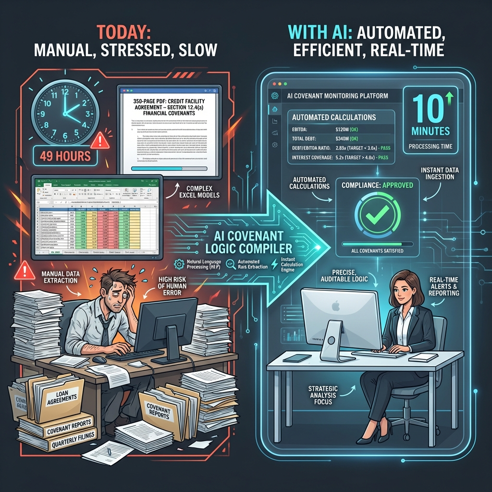
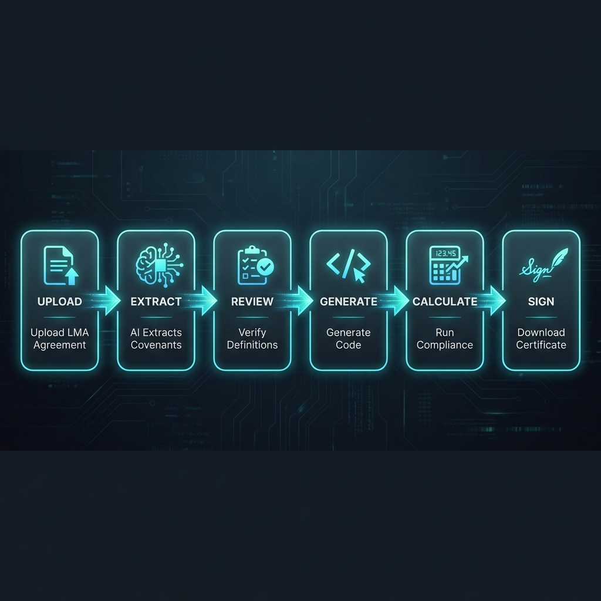
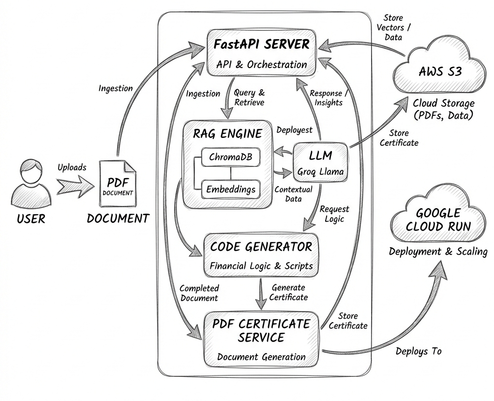

# Covenant Logic Compiler

### AI that turns legal loan agreements into automated compliance calculations

> **One sentence:** We convert covenant definitions from LMA loan agreements into executable code that automatically calculates compliance—eliminating 49 hours of manual Excel work per loan, per quarter.

[](https://covenant-api-609382621286.asia-south1.run.app/docs)

---

## Demo Video

> _Watch the 3-minute walkthrough showing the complete flow_

[▶️ Watch Demo Video](YOUR_VIDEO_LINK_HERE)

---

## The Transformation



_From 49 hours of manual Excel work to 10 minutes of automated compliance._

---

## User Flow



---

## The Problem We Solve

### The "Logic-to-Code Gap" in Covenant Monitoring

When a **$1 billion syndicated loan** is issued across 15 banks, someone must monitor whether the borrower is complying with financial covenants every quarter.

**Today's painful reality:**

| Who                      | What They Do                              | Time Spent              |
| :----------------------- | :---------------------------------------- | :---------------------- |
| **Borrower**             | Builds Excel to calculate covenants       | 4 hours/quarter         |
| **Agent Bank**           | Manually verifies borrower's calculations | 4 hours/quarter         |
| **15 Participant Banks** | Each recalculates independently           | 3 hours each = 45 hours |
| **Total**                | Duplicated manual work                    | **49 hours per loan**   |

> _This is called "stare and compare"—analysts stare at PDFs and Excel sheets, manually translating legal text into formulas._

**The real problem isn't bad UX or missing dashboards.**

**The problem is:** Every covenant definition is written in legal English, but compliance requires math. Someone must manually translate:

```
"Net Debt to EBITDA shall not exceed 4.0x"
```

into:

```
=IF(B2/B3 <= 4.0, "COMPLIANT", "BREACH")
```

This translation happens **manually, for every loan, every quarter.** It's slow, error-prone, and duplicated across all 15+ banks in a syndicate.

---

## Our Solution

### AI reads the contract. AI writes the code. Humans verify and sign.

```
┌─────────────────┐     ┌─────────────────┐     ┌─────────────────┐
│  Upload LMA     │     │  AI Extracts    │     │  Get Compliance │
│  Agreement PDF  │ ──▶ │  Covenant Logic │ ──▶ │  Certificate    │
│  (350 pages)    │     │  & Generates    │     │  Ready to Sign  │
│                 │     │  Python Code    │     │                 │
└─────────────────┘     └─────────────────┘     └─────────────────┘
         │                      │                       │
      30 seconds            10 seconds              Instant
```

**Before:** 49 hours of manual work across the syndicate.  
**After:** 10 minutes. Same result. Zero discrepancies.

---

## Key Features

### 1. Smart Document Upload

Upload any LMA-standard loan agreement PDF. Our AI finds Section 22 (Definitions) and extracts all covenant clauses automatically.

### 2. AI Covenant Extraction

We use RAG (Retrieval-Augmented Generation) to understand complex covenant definitions including:

- EBITDA calculation with add-backs and caps
- Senior Leverage and Total Leverage ratios
- Interest Coverage and Fixed Charge Coverage
- CapEx limits and other financial covenants

### 3. Automatic Code Generation

The AI converts legal definitions into executable Python code. No more Excel formula errors. The code is:

- **Transparent** — Banks can read and audit the logic
- **Deterministic** — Same inputs = same outputs, always
- **Shareable** — All syndicate members use identical calculations

### 4. Real-Time Compliance Testing

Input your quarterly financials and get instant pass/fail results with detailed breakdowns for each covenant.

### 5. LMA-Compliant Certificate Generation

Generate professional, audit-ready compliance certificates in the exact format required by Schedule 8 of LMA agreements. Ready for digital signature and submission.

---

## Why Current Solutions Don't Work

| Competitor     | What They Do                   | What's Missing                                |
| :------------- | :----------------------------- | :-------------------------------------------- |
| **Cardo AI**   | Data storage, field extraction | Humans still encode covenant logic manually   |
| **Moody's**    | Workflows and templates        | Covenants are too bespoke for templates       |
| **BankStride** | Reminders, document collection | Trusts borrower's certificate, doesn't verify |

**Our difference:** We don't just help humans work faster—we eliminate the translation step entirely.

---

## Commercial Viability

| Metric              | Value                                             |
| :------------------ | :------------------------------------------------ |
| **Time Savings**    | 99.7% reduction (49 hours → 10 minutes)           |
| **Error Reduction** | No more Excel formula mistakes                    |
| **Scalability**     | Same code works for all syndicate members         |
| **Market Size**     | Multi-trillion dollar syndicated loan market      |
| **Target Users**    | Agent banks, credit analysts, loan administrators |

### Value Proposition

- **For Borrowers:** Generate compliant certificates in minutes, not hours
- **For Agent Banks:** Verify borrower calculations instantly with confidence
- **For Participant Banks:** Transparent access to the same calculation logic

---

## Target Users

| User                    | Pain Point                               | How We Help                          |
| :---------------------- | :--------------------------------------- | :----------------------------------- |
| **Credit Analysts**     | 4+ hours per loan per quarter on Excel   | Instant automated calculations       |
| **Loan Administrators** | Manual verification is error-prone       | AI-verified compliance certificates  |
| **Participant Banks**   | Duplicate work across syndicate          | Shared, transparent calculation code |
| **Audit Teams**         | Tracing calculations to contract clauses | Every number links to source clause  |

---

## Technology Stack

| Layer              | Technology                                                  |
| :----------------- | :---------------------------------------------------------- |
| **Frontend**       | Next.js 14, TypeScript, Tailwind CSS, Shadcn UI             |
| **Backend**        | FastAPI (Python), Pydantic                                  |
| **AI/ML**          | Groq Llama 3.3 (LLM), Sentence Transformers, ChromaDB (RAG) |
| **Storage**        | AWS S3 (PDFs), ChromaDB (vectors)                           |
| **Deployment**     | Google Cloud Run (backend), Vercel (frontend)               |
| **PDF Generation** | ReportLab                                                   |

---

## System Architecture



_How the components work together to transform legal agreements into automated compliance._

---

## Live URLs

| Component             | URL                                                        |
| :-------------------- | :--------------------------------------------------------- |
| **Frontend**          | https://axiom-complier.vercel.app                          |
| **Backend API**       | https://covenant-api-609382621286.asia-south1.run.app      |
| **API Documentation** | https://covenant-api-609382621286.asia-south1.run.app/docs |

---

## How It Works (User Flow)

### Step 1: Upload Agreement

Drag and drop your LMA loan agreement PDF. The system securely stores it and prepares for analysis.

### Step 2: AI Extraction

Our AI reads the document, finds all covenant definitions, and extracts them with their limits and calculation formulas.

### Step 3: Review & Edit

Verify the extracted covenants. Make any necessary edits—you're always in control.

### Step 4: Generate Code

The system automatically generates executable Python code that implements your exact covenant calculations.

### Step 5: Calculate Compliance

Enter your quarterly financials. The system runs the calculations and shows pass/fail status for each covenant.

### Step 6: Sign & Download

Review results, apply your digital signature, and download a professional PDF compliance certificate.

---

## Example: How We Solve the "EBITDA Problem"

### The Challenge

A typical EBITDA definition in an LMA agreement looks like this:

> _"Consolidated EBITDA means operating profit before deducting interest or tax, after adding back depreciation, amortization, and Transaction Costs (up to €15M per annum), after adding back Synergies (capped at 20% of Consolidated EBITDA calculated before this add-back)..."_

This creates a **circular reference** that's tricky to implement in Excel.

### Our Solution

The AI converts this automatically into working code:

```python
def calculate_ebitda(operating_profit, depreciation, amortization,
                     transaction_costs, synergies_claimed):
    # Base EBITDA (before synergies)
    base = operating_profit + depreciation + amortization

    # Cap transaction costs at €15M
    allowed_transaction = min(transaction_costs, 15_000_000)
    base += allowed_transaction

    # Synergy cap: 20% of base EBITDA
    synergy_cap = base * 0.20
    allowed_synergies = min(synergies_claimed, synergy_cap)

    return base + allowed_synergies
```

**No more Excel circular reference errors. No more manual cap calculations.**

---

## Repository Structure

```
lmahack/
├── frontend/                 # Next.js web application
│   ├── src/app/dashboard/    # 6-step compliance wizard
│   └── src/components/       # Reusable UI components
│
├── backend/                  # FastAPI server
│   ├── app/api/              # REST endpoints
│   ├── app/agents/           # AI extraction logic
│   ├── app/services/         # RAG, S3, PDF services
│   └── Dockerfile            # Cloud Run deployment
│
└── README.md                 # You are here
```

---

## LMA Edge Hackathon

**Category:** Keeping Loans on Track

This project directly addresses the core challenge of the "Keeping Loans on Track" category—monitoring financial covenants efficiently and accurately throughout the life of a loan.

---

## Quick Start (For Developers)

### 1. Backend Setup

```bash
cd backend
python -m venv .venv
source .venv/bin/activate
pip install -r requirements.txt

# Create .env file with the following:
# GROQ_API_KEY=your_groq_key
# AWS_ACCESS_KEY_ID=your_aws_key
# AWS_SECRET_ACCESS_KEY=your_aws_secret
# AWS_REGION=ap-south-1
# AWS_S3_BUCKET_NAME=your_bucket_name

uvicorn app.main:app --reload --port 8000
```

### 2. Frontend Setup

```bash
cd frontend
pnpm install

# Create .env.local with:
# NEXT_PUBLIC_API_URL=http://localhost:8000/api/v1/agreements

pnpm dev
```

Open http://localhost:3000 to use the application.

---

## 📄 License

MIT

---

## Team

Built with ❤️ for the LMA Edge Hackathon 2026

---

_Reimagining how loans are monitored—one covenant at a time._
